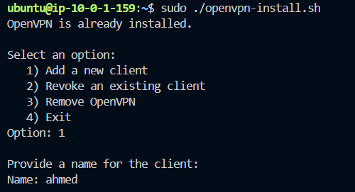
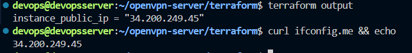
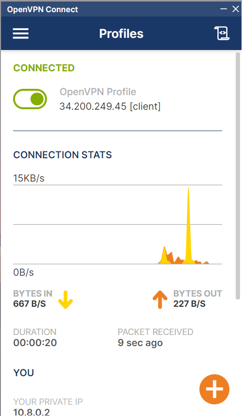

# 🚀 OpenVPN EC2 Deployment with Terraform

This project automates the provisioning of an AWS EC2 instance and installs an OpenVPN server using Terraform. It handles the following:

- Creates a secure and properly routed AWS VPC with a public subnet.
- Deploys an EC2 instance with Ubuntu 22.04.
- Installs and configures OpenVPN using a custom `openvpn-install.sh` script.
- Automatically transfers the generated `client.ovpn` file to the local user's machine for easy connection.

---

## 📁 Project Structure

```bash
.
├── images
│   ├── screen1.png
│   └── screen2.png
├── openvpn-install.sh
├── main.tf
├── outputs.tf
├── variables.tf
└── README.md
```

---

## ✅ Prerequisites

Before you begin, make sure you have:

- An [AWS account](https://aws.amazon.com/)
- [Terraform](https://developer.hashicorp.com/terraform/install) v1.3+ installed
- An SSH key pair generated locally (`~/.ssh/id_rsa` and `~/.ssh/id_rsa.pub`)
- S3 backend bucket already created for remote state (as defined in `main.tf`)

---

## 🔧 Setup and Usage

### 1. Clone the Repository

```bash
git clone https://github.com/Ahmed-Elhgawy/openvpn-server.git
cd openvpn-server
```

### 2. Customize Variables (Optional)

Edit `variables.tf` or override values via CLI:

```bash
terraform plan \
  -var="my_public_ip=YOUR_PUBLIC_IP/32" \
```

⚠️ Default allows SSH from any IP. For security, set `my_public_ip` to your machine's IP.

###3. Initialize Terraform

```bash
terraform init
```

### 4. Apply the Terraform Configuration

```bash
terraform apply
```
This will:
- Spin up the infrastructure
- Copy `openvpn-install.sh` to the EC2 instance
- Make the script executable and run it remotely
- Download the generated `client.ovpn` config file to `~/client.ovpn`

--- 

## 🔑 Connecting to OpenVPN

Once provisioning is complete:
1. Use the downloaded `~/client.ovpn` file.
2. Import it into your VPN client (e.g., [OpenVPN Connect](https://openvpn.net/client/)).
3. Connect to your VPN.

---

## 🧹 Cleanup

To destroy all resources:

```bash
terraform destroy
```

---

## ➕ Adding a New VPN Client

You can add additional VPN clients at any time by SSH'ing into your EC2 instance and running the OpenVPN installer script again.

### 🧩 Steps:

```bash
ssh ubuntu@<instance_public_ip>
sudo ./openvpn-install.sh
```

1. Choose "Add a new client" (Option 1)
2. Enter a name for the client (e.g., ahmed)
3. The script will generate a new .ovpn configuration file for the new client
4. Secure copy (SCP) the .ovpn file back to your local machine:

```bash
scp -i ~/.ssh/id_rsa ubuntu@<instance_public_ip>:<client_name>.ovpn ~/client_<client_name>.ovpn
```

### 💡 Example:



## 🛠️ Customization

You can modify `openvpn-install.sh` to preconfigure users, change ports, or apply advanced OpenVPN configurations. Make sure the file is executable and located in the project root.

---

## 🔐 Security Notes

- SSH access is limited to the IP provided in `my_public_ip`.
- VPN uses default configurations from the installer script — update it to enforce stricter security policies if needed.
- The `.ovpn` file is downloaded to the home directory. Handle it securely.

---

## 📦 Outputs

After a successful deployment, Terraform will output:
- `instance_public_ip`: The public IP of the OpenVPN server.

---

## 📸 Screenshots

| ✅ Successful Terraform Deployment | 🔗 OpenVPN Client Connected |
| ---------------------------------- | ---------------------------- |
| Shows the terminal output after deploying the infrastructure and installing OpenVPN. | Demonstrates a successful connection using the downloaded `client.ovpn` file. |
|  |  |

---

## 🙋 Support

If you encounter any issues or have feature requests, feel free to open an issue or contribute to the repository.

---